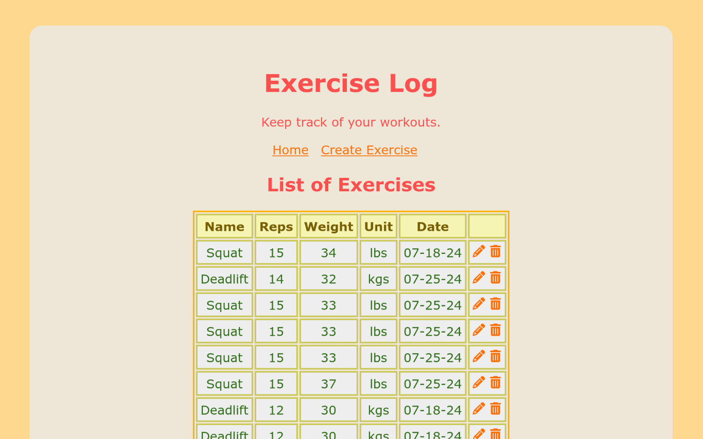

# CS 290 Portfolio Assignment

My submission on assignment 9, the portfolio assignment, from [CS 290](https://ecampus.oregonstate.edu/soc/ecatalog/ecoursedetail.htm?subject=CS&coursenumber=290&termcode=ALL) during Winter 2025 quarter on Oregon State University Ecampus, instructed by Pam Van Londen and Nauman Chaudhry.

A simple exercise logger in a full-stack MongoDB, Express, React, Node (MERN) app.



## Requirements

- [Node.js](https://nodejs.org/en/download/) 22
- A [MongoDB](https://www.mongodb.com/) database
  - Such options include [setting up a local instance](https://www.mongodb.com/docs/manual/installation/) or using [MongoDB Atlas](https://www.mongodb.com/atlas)

## Backend - `rest/`

### Configure

In `rest/.env`, set `MONGODB_CONNECT_STRING` to your MongoDB database

### Install dependencies

```
cd rest
npm install
```

### Start the backend server

```
npm start
```

### Testing

Using [Visual Studio Code](https://code.visualstudio.com/), install the [REST Client extension](https://marketplace.visualstudio.com/items?itemName=humao.rest-client) and use the `a9-test-requests.http` file to run example requests against the backend server.

## Frontend - `react/`

### Install dependencies

```
cd react
npm install
```

### Start the development server

```
npm run dev
```
